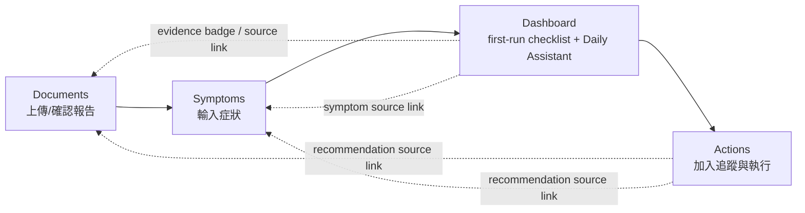

# P125 — First-Run Activation Polish Discovery (2026-06-01)

## Final Classification
`P125_FIRST_RUN_ACTIVATION_POLISH_DISCOVERY_READY`

## Discovery Verdict
`can-implement-minimal-polish`

## Phase 0 Actual Observations
- Repo: `/Users/kelvin/Kelvin-WorkSpace/PersonalHealthOS`
- Branch: `main`
- Git dir: `.git` (not worktree, not detached)
- P124 commit present: `0329834 test(frontend): P124 verify first-run evidence integration`
- P123 commit present: `a5a6785 feat(frontend): P123 add minimal first-run journey`
- P121 commit present: `9c4ff0b feat(backend): P121 propagate suppression reason in evidence bundle`
- Pre-existing dirty/untracked files remained known governance/runtime/environment artifacts:
  - modified: `00-Plan/roadmap/CEO-Decision.md`, `00-Plan/roadmap/CTO-Analysis.md`, `00-Plan/roadmap/active_task.md`, `00-Plan/roadmap/roadmap.md`
  - untracked: `backend/test-results/`, `frontend/tests/e2e/p118-suppression-reason-badge-contract.spec.mjs`, `node_modules/`, root `package.json`, root `package-lock.json`
- No Phase 0 STOP condition triggered.

## P123/P124 Current-State Summary
- P123 established minimal first-run checklist in Dashboard Daily Assistant entry:
  - state model: `empty` / `in_progress` / `completed`
  - route links: documents, symptoms, dashboard, actions
- P124 confirmed journey-to-evidence alignment:
  - dashboard top recommendation evidence cue: `daily-toprec-evidence-badge`
  - actions recommendation source link: `p89-source-page-link`
  - suppressed/not-judged (`suppressed_unit_scale_mismatch`) copy remains cautious and non-overclaim

Result: the flow is now executable and evidence-aware, but still needs activation polish to reduce first-run completion friction.

## First-Run Activation Path Map

## Polish Gap Table
| # | Observation | Activation impact | Scope type | Suggested polish direction |
|---|---|---|---|---|
| G1 | Checklist completion semantics are clear for report/symptom/assistant, but action step has no explicit completion criterion in first-run card | Medium | UI copy/state cue | clarify what counts as action-step completion (e.g., add one recommended action into tracking) |
| G2 | `in_progress` state gives one-next-step hint, but does not show compact overall progress (e.g., 1/3 or 2/3) | Medium | UI copy micro-structure | add minimal progress indicator text without introducing state machine |
| G3 | Evidence cues exist, but first-run card does not explicitly tell new users where to verify recommendation source after completion | Medium | UI copy/link hint | add “查看建議依據” style cue to reduce uncertainty |
| G4 | Empty-state tone differs across documents/symptoms/actions pages, causing onboarding consistency friction | Low-Medium | UI copy consistency | align empty/half-complete wording to same activation language |
| G5 | Suppressed/not-judged note is safe, but route-to-action context for this uncertainty can be more explicit (“先追蹤再判讀”) | Low | safety copy | keep conservative wording and add one practical follow-up hint |

## Prioritization

### Must-have for activation
1. Clarify action-step completion criterion in first-run card (`completed` state should explain what to do next in concrete terms).
2. Add compact progress cue for `in_progress` (reduce ambiguity in “還差哪一步”).
3. Add explicit evidence-verification hint from first-run completion context to existing evidence-aware surfaces.

### Nice-to-have
1. Harmonize empty-state copy tone across documents/symptoms/actions with one activation phrasing pattern.
2. Improve suppressed/not-judged follow-up wording to nudge tracking behavior.

### Defer / Not now
1. Any persisted onboarding workflow state machine.
2. New backend event pipeline or DB-backed funnel model.
3. New route/page for onboarding.

### Blocked-by-runtime-evidence
- None for minimal polish lane.
- Existing runtime already exposes enough UI hooks and evidence cues for a frontend-only polish increment.

## Recommended P126 Lane
P126 should be a **small UI/copy/test polish lane** on top of P123/P124 behavior:
- No new endpoint, no schema/model change, no DB migration.
- Keep current route structure and evidence mapping.
- Focus on first-run card clarity + evidence verification guidance + copy consistency.

Proposed lane title:
- `P126 First-Run Activation Minimal Polish Implementation`

## Proposed P126 Allowed File Whitelist
- `frontend/app/components/platform/daily-assistant-entry.tsx`
- `frontend/app/platform/documents/page.tsx`
- `frontend/app/platform/symptoms/page.tsx`
- `frontend/app/platform/actions/page.tsx`
- `frontend/tests/e2e/p126-first-run-activation-polish-contract.spec.ts`
- `docs/product/p126-first-run-activation-polish-implementation.md`
- `00-Plan/roadmap/active_task_report.md`

## Proposed P126 Test Strategy
Targeted only; no full regression sweep by default.

1. Mandatory for P126:
- `cd frontend && npx tsc --noEmit`
- `cd frontend && npx playwright test tests/e2e/p126-first-run-activation-polish-contract.spec.ts --reporter=line`

2. Run existing guards only if touched surface changed:
- `cd frontend && npx playwright test tests/e2e/p123-first-run-journey-contract.spec.ts --reporter=line`
- `cd frontend && npx playwright test tests/e2e/p124-first-run-evidence-integration-contract.spec.ts --reporter=line`
- `cd frontend && npx playwright test tests/e2e/p76-daily-assistant-signal-contract.spec.ts --reporter=line`
- `cd frontend && npx playwright test tests/e2e/p82-actions-page-contract.spec.ts --reporter=line`
- `cd frontend && npx playwright test tests/e2e/p85-documents-page-contract.spec.ts --reporter=line`
- `cd frontend && npx playwright test tests/e2e/p86-symptoms-page-contract.spec.ts --reporter=line`
- `cd frontend && npx playwright test tests/e2e/p101-report-symptom-recommendation-integration.spec.ts --reporter=line`

3. Build gate:
- Run `cd frontend && npx next build` only when runtime TS/TSX changed.

## Risks / Known Limitations
1. Discovery is based on source + existing contract evidence; no new runtime experiments executed in this lane.
2. Copy polish can accidentally regress overclaim safety if not guarded by prohibited-phrase checks.
3. Multi-page wording harmonization can sprawl; P126 should keep strict “minimal text-level changes” boundaries.

## Final Recommendation
Proceed to P126 as a frontend-only minimal polish implementation lane.
No backend/DB expansion is needed to improve activation completion quality at this stage.
